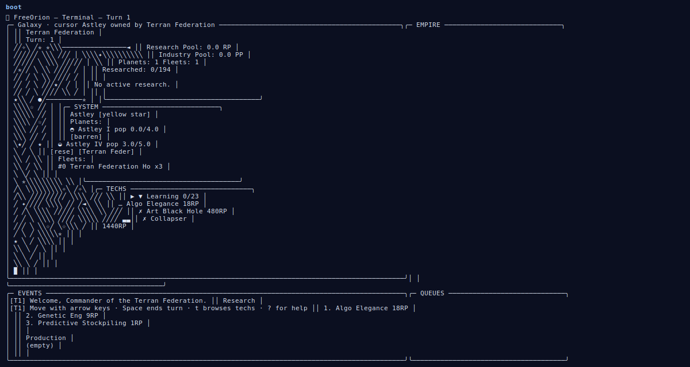
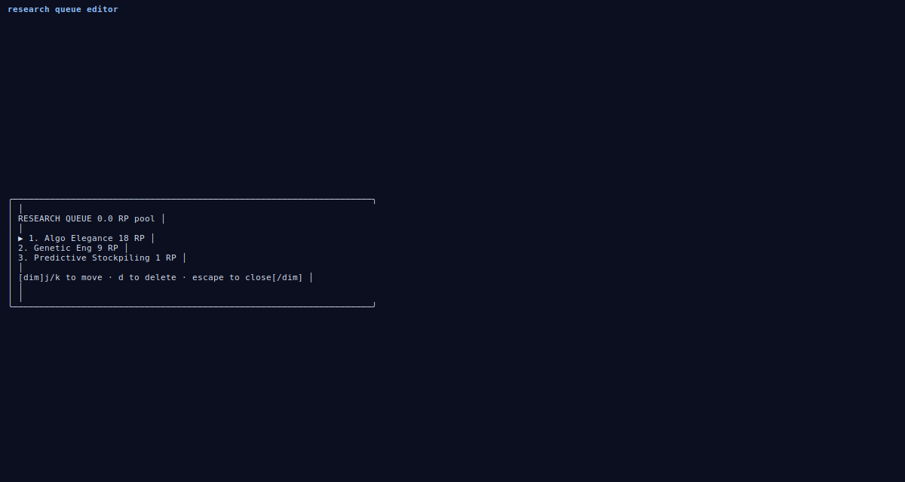

# freeorion-tui
The galaxy is yours to command.




## About
A thousand stars. Six alien species. One galaxy at stake. Stake your claim, research the tech tree, queue production, end the turn — and watch heat-mapped overlays light up with research, population, ownership. Save, load, or hand the reins to a script via the REST API. Strategic space 4X in the spirit of MOO, now in 80×24.

## Screenshots


## Install & Run
```bash
git clone https://github.com/akakabrian/freeorion-tui
cd freeorion-tui
make
make run
```

## Controls
<Add controls info from code or existing README>

## Testing
```bash
make test       # QA harness
make playtest   # scripted critical-path run
make perf       # performance baseline
```

## License
MIT

## Built with
- [Textual](https://textual.textualize.io/) — the TUI framework
- [tui-game-build](https://github.com/akakabrian/tui-foundry) — shared build process
